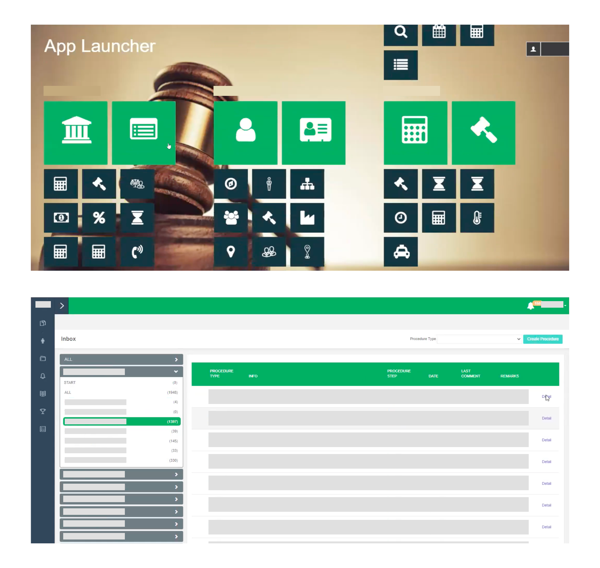
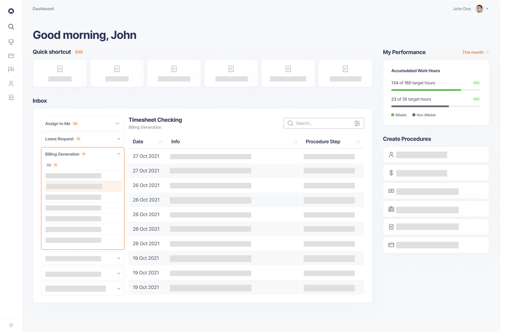
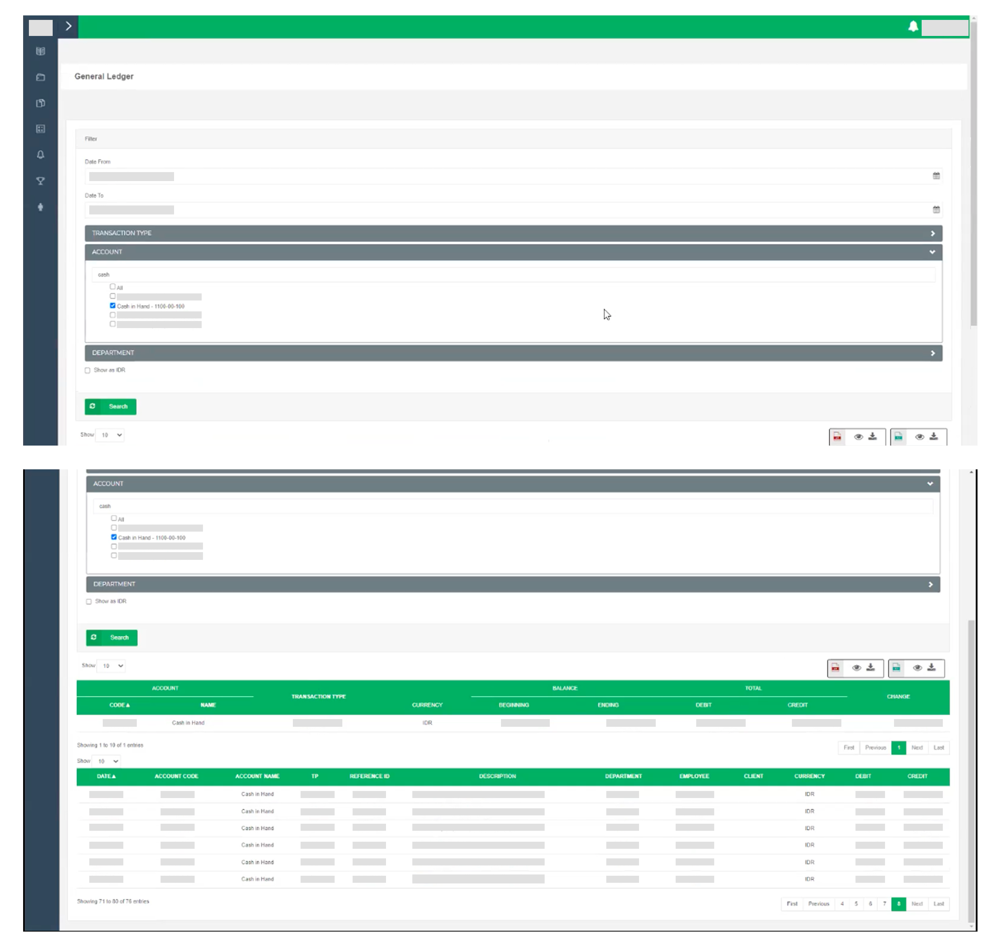
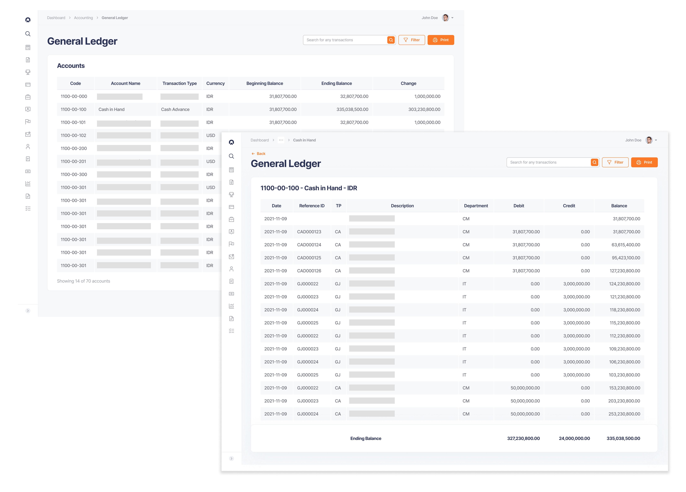

In late 2021, I led the UI/UX revamp of an internal ERP system for one of the top tier law firms in Indonesia. The interface hadn't kept pace with the firm's needs and some critical workflows were being split between our tool and external software. My role was to understand why and redesign the experience accordingly.

## About the Internal Tool

The internal tool (I'll refer to this system as the 'internal tool' throughout the essay) was used across all departments and included department-specific modules tailored to the needs of each department (for instance, General Ledger module is mainly used by their accountants) beside some general features like Inbox (internal email platform as task management and communication channel). Significant research and design work in this project were quite interesting to uncover, but I’ll focus only on the general concept and one of the revamped features.

## The Process Involved Comprehensive User Research and Contextualize Design

Due to the tight timeline and sheer number of modules along with stakeholders to be interviewed, we decided to focus on splitting the first phase of the project with doing user research and designing UI kit in parallel. I was in charge of the user research while a UI designer was focusing on the design system. This foundational phase involved interviews with 17 employees across multiple departments to understand their pain points and workflows.

We then shared our findings and began designing the UX and UI of all the software modules. High fidelity design was implemented right away after we identified the problems from analysis of the user research. During the research presentation, some proposed design with the UI kit was already shared so we got the green light in terms of the design elements and UI components that we can implement.

The last phase was user testing and development support. We interviewed the same respondents again to validate our design solution. The interview results are compiled and analysed for the last presentation and final design revision. We then handed off the design to the engineering team and I provided development support for about 3 months where I helped their frontend engineer to implement the design.

## Straightforward Task Management as The Central Design Decision

The existing tool was already capable of covering administrative work and managing customized features for different kinds of employees. For example, accountants were only exposed with features related to billing and accounting. But all employees have access to Inbox, where all requests (like paid leave and approval) and tasks (like supervising certain project progress) was managed.

One of the insights of our research revealed that most friction stemmed from poor interface usability (long forms, multiple buttons without clear hierarchy). Our principal designer came up with the direction to turn the entire experience into a dashboard, which can help employees to intuitively get into their task since the first time they visited the tool. The Inbox feature became the central function in the tool homepage, which started the user flow to other modules they need to work on at the beginning of the day.

## Understanding How Users Actually Work

One of the modules that I redesigned was the General Ledger, which was a tool the accounting team underutilized because usability friction pushed them toward external alternatives. They migrated the financial data from the internal tool every time they did their tasks. Based on the understanding of their workflows and needs to use alternative tools, I came up with the revamped General Ledger interface. During the usability testing session, the revamped version has met the expected functionality and proven to provide sufficient support for the accounting team. This improvement helped the team to work more efficiently and seamlessly since they do not need to operate different tools.

## Outcome

The project lasted around five months with additional three months to support the engineer team. We successfully delivered a fully-revamped interface with better usability to the tool based on contextual user workflows and needs. We followed an end-to-end process from initial research until user testing to realise a tool which eliminated hassle in the interface and promoted better workflows. The project also revealed opportunities to refine performances and advanced workflows down the line. But fundamentally, it taught me how deeply interconnected task management, tool design, and daily workflows are.
